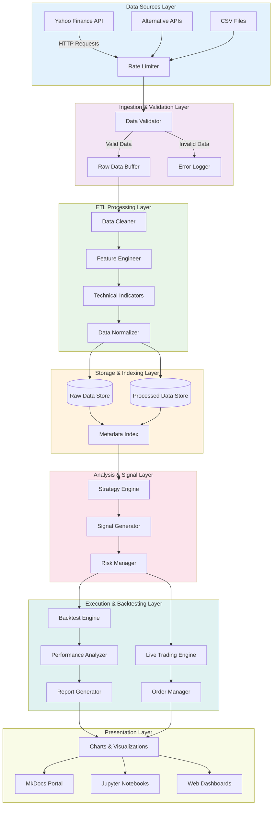
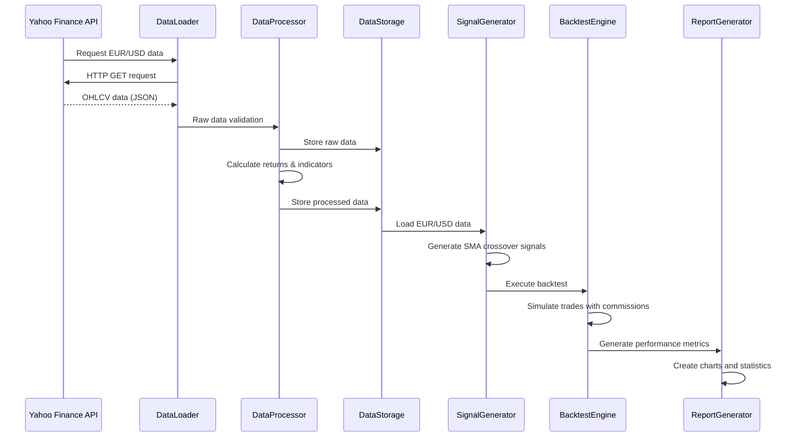

# System Design & Data Flow Architecture

## Overview

AlphaTwin implements a systematic approach to quantitative trading, transforming raw market data into actionable trading signals through a well-defined data pipeline. This document outlines the complete system design and data flow architecture.

## Core Architecture Principles

1. **Modular Design**: Each component has clear responsibilities and interfaces
2. **Data Immutability**: Raw data is never modified; transformations create new datasets
3. **Error Resilience**: Comprehensive error handling and logging throughout the pipeline
4. **Scalability**: Architecture supports both backtesting and live trading modes
5. **Observability**: Full logging and monitoring capabilities

## Data Flow Architecture

## Component Specifications

### Data Sources Layer

**Purpose**: Centralized data acquisition from multiple sources
**Components**:
- **Yahoo Finance API**: Primary market data source for stocks, forex, crypto
- **Rate Limiter**: Prevents API quota exhaustion (max 2,000 requests/hour)
- **Fallback Sources**: Alternative APIs for redundancy
- **File Ingestion**: Support for CSV/historical data imports

**Data Format**: OHLCV (Open, High, Low, Close, Volume) + dividends/splits

### Ingestion & Validation Layer

**Purpose**: Ensure data quality and integrity before processing
**Validation Rules**:
- Date format consistency
- Price data completeness
- Volume data validity
- Duplicate detection
- Outlier identification

**Error Handling**: Invalid data logged with timestamps and rejection reasons

### ETL Processing Layer

**Purpose**: Transform raw data into analysis-ready format
**Pipeline Stages**:

1. **Data Cleaning**:
   - Missing value imputation
   - Dividend adjustment
   - Stock split adjustments
   - Trading halt filtering

2. **Feature Engineering**:
   - Return calculations (arithmetic/logarithmic)
   - Volatility measures (rolling std, Parkinson)
   - Volume indicators (OBV, VWAP)

3. **Technical Indicators**:
   - Moving averages (SMA, EMA, WMA)
   - Momentum indicators (RSI, MACD, Stochastic)
   - Volatility indicators (Bollinger Bands, ATR)
   - Volume indicators (Volume Rate of Change)

4. **Data Normalization**:
   - Z-score standardization
   - Min-max scaling
   - Robust scaling for outliers

### Storage & Indexing Layer

**Purpose**: Efficient data storage and retrieval
**Storage Strategy**:
- **Raw Data**: Compressed Parquet format with metadata
- **Processed Data**: Indexed HDF5 for fast time-series access
- **Metadata Index**: SQLite database for data discovery

**Indexing**: Multi-level indexing by symbol, date, and data type

### Analysis & Signal Layer

**Purpose**: Generate trading signals from processed data
**Strategy Types**:
- **Trend Following**: Moving average crossovers, trend strength
- **Mean Reversion**: RSI, Bollinger Bands, statistical arbitrage
- **Momentum**: Price momentum, volume momentum
- **Machine Learning**: Supervised learning models

**Risk Management**:
- Position sizing algorithms
- Stop-loss mechanisms
- Risk parity allocation
- Maximum drawdown controls

### Execution & Backtesting Layer

**Purpose**: Simulate and execute trading strategies
**Backtesting Engine**:
- Event-driven architecture
- Transaction cost modeling
- Slippage simulation
- Realistic market impact modeling

**Performance Analysis**:
- Risk-adjusted returns (Sharpe, Sortino ratios)
- Drawdown analysis
- Win/loss statistics
- Holding period analysis

### Presentation Layer

**Purpose**: Visualize results and enable interaction
**Output Formats**:
- **Static Reports**: PDF/HTML performance reports
- **Interactive Charts**: Plotly-based visualizations
- **Web Dashboards**: Streamlit applications
- **Jupyter Notebooks**: Exploratory analysis environment

## Data Flow Example: EUR/USD Trading Strategy

## Error Handling & Monitoring

### Error Types & Responses

1. **Data Source Errors**:
   - API rate limits: Exponential backoff retry
   - Network failures: Circuit breaker pattern
   - Data unavailability: Fallback to cached data

2. **Processing Errors**:
   - Invalid data: Skip and log, continue processing
   - Memory issues: Batch processing with cleanup
   - Calculation errors: Fallback to simplified methods

3. **Storage Errors**:
   - Disk space: Alert and cleanup old data
   - Permission issues: Revert to read-only mode
   - Corruption: Automatic integrity checks

### Logging Strategy

- **Application Logs**: Structured JSON logging with log levels
- **Performance Logs**: Execution times and resource usage
- **Error Logs**: Detailed stack traces with context
- **Audit Logs**: All data modifications and access

### Monitoring Dashboard

- **System Health**: CPU, memory, disk usage
- **Pipeline Status**: Processing queue lengths, success rates
- **Data Quality**: Validation pass/fail rates
- **Trading Performance**: Real-time P&L, risk metrics

## Performance Optimizations

### Data Processing
- **Vectorized Operations**: Pandas/NumPy for efficient calculations
- **Parallel Processing**: Dask for large dataset processing
- **Memory Management**: Chunked processing for large datasets

### Storage
- **Compression**: Snappy/LZ4 for fast compression/decompression
- **Partitioning**: Time-based partitioning for query optimization
- **Caching**: Redis for frequently accessed data

### Computation
- **Algorithm Optimization**: Numba JIT compilation for bottlenecks
- **GPU Acceleration**: CuPy for matrix operations (future)
- **Distributed Computing**: Dask cluster for large backtests

## Security Considerations

- **API Key Management**: Encrypted storage with rotation
- **Data Encryption**: At-rest encryption for sensitive data
- **Access Control**: Role-based permissions for different users
- **Audit Trail**: Complete logging of all system activities

## Future Extensions

- **Real-time Data**: WebSocket connections for live data
- **Multi-Asset Support**: Equities, forex, commodities, crypto
- **Machine Learning**: Deep learning models for prediction
- **Portfolio Optimization**: Multi-asset portfolio construction
- **Live Trading**: Integration with brokerage APIs

---

*This system design provides a solid foundation for quantitative trading while maintaining flexibility for future enhancements and scalability requirements.*
