# Technology Stack & Architecture

## Mission: Applying Industry 4.0 Principles to Financial Markets

AlphaTwin represents the convergence of industrial automation principles with quantitative finance, creating a "digital twin" of financial markets that enables systematic, data-driven trading decisions.

## Technical Architecture

```mermaid
graph TD
    subgraph Data_Layer [Data Layer - Industry 4.0 IoT]
        A[Yahoo Finance API] -->|Real-time Data| B(Pandas Data Processing)
        B -->|ETL Pipeline| C[(Local Storage - Parquet)]
        D[Alternative Sources] -->|APIs| B
    end

    subgraph Logic_Layer [Quant Engine - Automation Core]
        E[VectorBT / Backtrader] -->|Backtesting Framework| F{Strategy Logic Engine}
        F -->|Signal Generation| G[Portfolio Optimization]
        H[Machine Learning] -->|Predictive Models| F
    end

    subgraph Presentation_Layer [Digital Twin Interface]
        I[Jupyter Notebook] -->|Interactive Analysis| J[Real-time Dashboards]
        K[MkDocs Portal] -->|Documentation Hub| L[Video Content Pipeline]
        M[Streamlit Apps] -->|Web Interfaces| J
    end

    subgraph DevOps_Layer [Infrastructure Automation]
        N[Docker Containers] -->|Environment Consistency| O[GitHub Actions]
        O -->|CI/CD Pipeline| P[Automated Deployment]
    end

    C --> E
    G --> I
    I --> K
    N -->|Containerization| Data_Layer
    N -->|Containerization| Logic_Layer
    N -->|Containerization| Presentation_Layer

    style Data_Layer fill:#1e3a5f
    style Logic_Layer fill:#2d5f2d
    style Presentation_Layer fill:#5f2d2d
    style DevOps_Layer fill:#5f5f2d
```

## Core Components

### Data Acquisition System
- **Primary Source**: Yahoo Finance API for historical market data
- **Data Processing**: Pandas-based ETL pipelines with automated cleaning
- **Storage**: Efficient Parquet format for time-series data
- **Extensibility**: Modular design for additional data sources

### Quantitative Engine
- **Backtesting Framework**: VectorBT for vectorized backtesting operations
- **Strategy Development**: Modular signal generation system
- **Risk Management**: Integrated portfolio optimization and risk metrics
- **Performance Analytics**: Comprehensive return and risk analysis

### Digital Twin Interface
- **Interactive Analysis**: Jupyter notebooks for exploratory data analysis
- **Documentation Portal**: MkDocs with Mermaid.js for technical visualization
- **Web Applications**: Streamlit for interactive trading dashboards
- **Content Pipeline**: Integrated video production and documentation workflow

### Infrastructure Automation
- **Containerization**: Docker for consistent development environments
- **Version Control**: Git with structured commit practices
- **CI/CD**: GitHub Actions for automated testing and deployment
- **Environment Management**: Pyenv for Python version consistency

## Industry 4.0 Principles Applied

1. **Interoperability**: Standardized APIs and data formats across all components
2. **Information Transparency**: Real-time dashboards and comprehensive logging
3. **Technical Assistance**: Automated backtesting and strategy optimization
4. **Decentralized Decisions**: Distributed computation with centralized oversight

## Development Roadmap

- **Phase 1**: Infrastructure and documentation portal ✅
- **Phase 2**: Core trading strategies and backtesting engine
- **Phase 3**: Machine learning integration and predictive models
- **Phase 4**: Live trading interface and risk management
- **Phase 5**: Multi-asset portfolio optimization and scaling

---

*This architecture represents a systematic approach to quantitative trading, emphasizing automation, transparency, and continuous improvement - the same principles that revolutionized manufacturing in Industry 4.0.*
