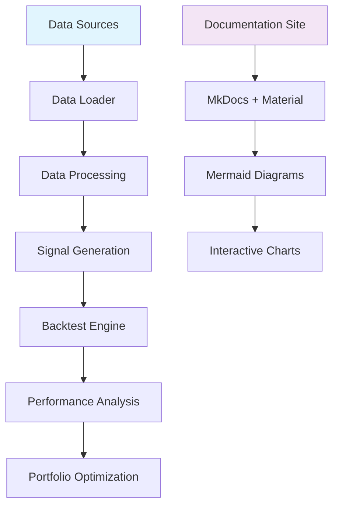

# AlphaTwin: Quantitative Trading Platform

Welcome to AlphaTwin, where data meets strategy in the pursuit of alpha generation.

## Our Mission

To democratize quantitative trading by providing an open-source platform that combines cutting-edge data science, machine learning, and systematic trading strategies. We believe that superior investment returns should be accessible through rigorous methodology, not market timing or luck.

## What is AlphaTwin?

AlphaTwin is a comprehensive quantitative trading platform designed from the ground up to be:

- **Data-Driven**: Automated collection and processing of market data
- **Strategy-Focused**: Modular signal generation and trading logic
- **Backtest-Rigorous**: Comprehensive performance evaluation and risk analysis
- **Documentation-Centric**: Interactive site with live visualizations and architecture diagrams

## Architecture Overview

## Key Features

### 🔄 Automated Data Pipeline
- Real-time market data collection from multiple sources
- Robust data cleaning and preprocessing
- Efficient storage and retrieval systems

### 📊 Strategy Development
- Modular signal generation framework
- Multiple trading strategies (momentum, mean-reversion, ML-based)
- Easy strategy backtesting and comparison

### 📈 Performance Analytics
- Comprehensive backtesting engine
- Risk metrics and drawdown analysis
- Interactive performance visualization

### 🌐 Interactive Documentation
- Live-updating documentation site
- Architecture diagrams with Mermaid.js
- Embedded interactive charts and plots

## Getting Started

Ready to explore the world of quantitative trading?

[� Operations Manual](manual/runbook.md) | [🏗️ System Architecture](architecture/system_design.md) | [🎯 MVP Requirements](requirements/mvp_goals.md)

## Community

Join our community of quantitative traders and developers:

- [GitHub Repository](https://github.com/jarry88/AlphaTwin)
- [Discussion Forum](https://github.com/jarry88/AlphaTwin/discussions)

---

*AlphaTwin is an open-source project. We welcome contributions from developers, researchers, and quantitative traders worldwide.*
