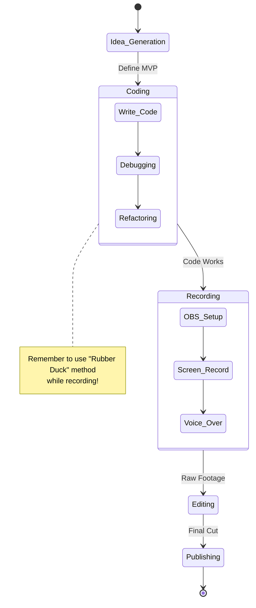

# 🎬 Content Production Workflow

我的 "Code-to-Video" 生产流水线。

## 🔄 The Pipeline (Visualized)

```mermaid
stateDiagram-v2
    [*] --> Idea_Generation
    Idea_Generation --> Coding: Define MVP

    state Coding {
        Write_Code --> Debugging
        Debugging --> Refactoring
    }

    Coding --> Recording: Code Works

    state Recording {
        OBS_Setup --> Screen_Record
        Screen_Record --> Voice_Over
    }

    Recording --> Editing: Raw Footage
    Editing --> Publishing: Final Cut
    Publishing --> [*]

    note right of Coding
        Remember to use "Rubber Duck" method
        while recording!
    end note
```
